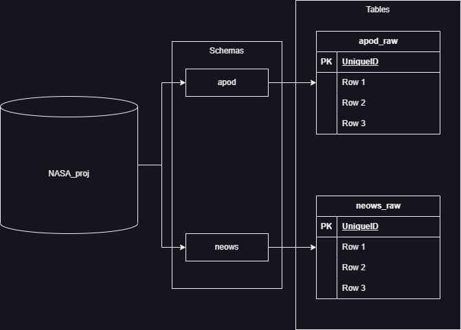
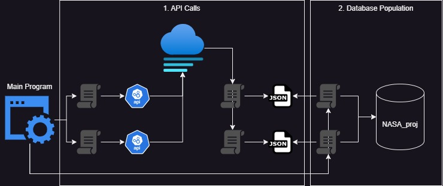

#### Updated 01/14/2024 Current version: 1.1

# NASA_proj Data Pipeline Project using NASA Open API Web Services 


This project has currently has two components.
- API calls
- Database Initialization

The `main.py` script first runs each API fetching script in sequence and downloads the data to a JSON file.  
Second, it takes the JSON file and parses it, uploading it to a local PostgreSQL database.  
The database consists of a schema for each JSON uploaded by the `DF/main.py` script.  
It also contains a priliminary `<table_name>_raw` table for each JSON file uploaded.
Currently, the database will contain information pertaining to each NASA Open API web service since 2024.



## Components
The project is broken down into sections.
1. APIs\
*Calls each of the NASA Open API Web Services and load them into JSON files.*
2. Data Factory\
*Creates new tables in Database to house JSON information.*

- `./APIs`
- `./DF`
- `./media`
- `./main.py`
- `./readme.md`
- `./requirements.txt`

## Packages Used
- requests
- json
- psycopg2
- datetime
- dotenv
- python.dotenv

## Workflow

1. **Calls each NASA Open API Web Service in turn**
    - APOD
    - NeoWs
2. **Loads each API call into its own JSON file**
    - apod.json
    - neows.json
3. **Creates new table for each JSON file**
    - apod.apod_raw
    - neows.neows_raw
4. **Loads data from JSON files**

## Release Plan
- **Version 1.1**
    - Create first draft.
    - Connect to APOD and NeoWS APIs.
    - Create database connection and upload data (2024-present) for APOD and NeoWS.
- **Version 1.2** (WIP)
    - Connect to DONKI API.
    - Create table and upload data for (2024-present) for DONKI.

## Installation and Execution
*Note:* This project uses python3.
1. **Clone Repository:**
    ```bash
    git clone https://github.com/CollinClifford/NASA_proj
    cd NASA_proj
2. **Install Dependencies:**
    ```bash
    pip install -r requirements.txt
3. **Configure Environment Variables:**
    Create a `.env` file in the project root with the necessary environment variables with the following as a template.
    ```bash
    # API Key

    API_KEY=

    # Database connections
    DB_HOST=
    DB_NAME=
    DB_USER=
    DB_PASSWORD=
    DB_PORT=
    SSL_MODE=disable
4. **Run the Program:**\
    Execute the bash script:
    ```bash
    python3 ./main.py
